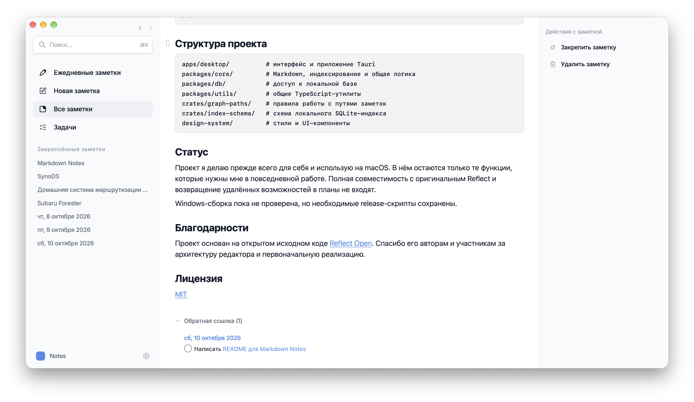
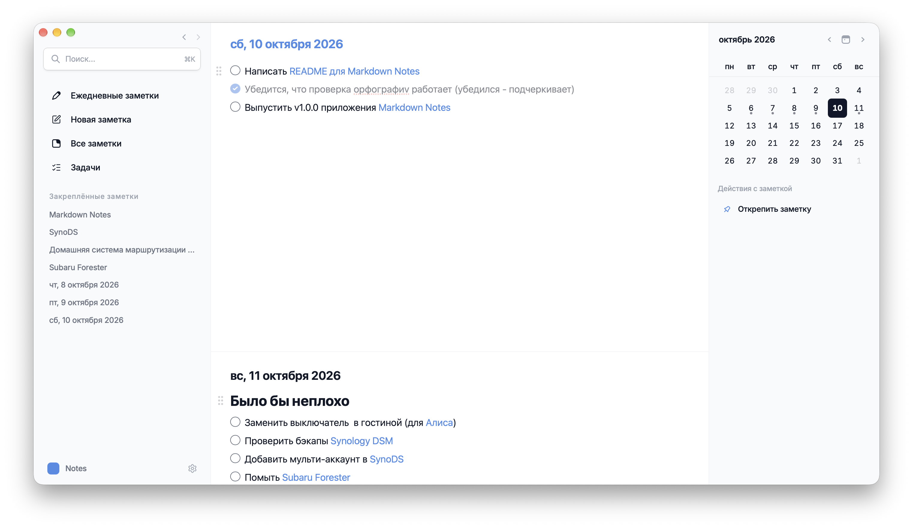

# Markdown Notes

Простой локальный редактор Markdown-заметок для macOS, построенный вокруг ежедневных заметок, wiki-ссылок, обратных ссылок и задач.

[](LICENSE)



## Зачем существует этот форк

Markdown Notes — персональный форк [Reflect Open](https://github.com/team-reflect/reflect-open), адаптированный под мой личный workflow: именно так я привык работать в Obsidian, используя только минимально необходимый набор функций — даже без шаблонов.

Цель проекта — не повторить все возможности Obsidian и не создать универсальную платформу для заметок, а оставить небольшой и понятный инструмент:

- заметки хранятся обычными Markdown-файлами;
- приложение быстро открывается сразу на сегодняшней заметке;
- wiki-ссылки, backlinks и задачи работают без дополнительной настройки;
- папку с заметками можно синхронизировать любым файловым сервисом, например Synology Drive;
- файлы остаются доступными для других редакторов и не привязаны к приложению.

Из исходного Reflect удалены функции, которые не нужны этому сценарию: AI и чат, аудиозаметки и транскрибация, браузерное расширение, CLI, встроенный Git-sync, шаблоны и связанные с ними служебные модули. Интерфейс упрощён, локализован на русский язык и визуально настроен для повседневной работы на macOS.

## Возможности

- ежедневные заметки — отдельными страницами или в непрерывной ленте; файлы разбиваются по годам (`daily/YYYY/YYYY-MM-DD.md`), потому что я так привык 🙂;
- обычные Markdown-заметки;
- `[[wiki-ссылки]]` и входящие обратные ссылки;
- быстрый локальный поиск по заметкам;
- теги;
- задачи, сроки и отдельный список задач;
- закреплённые заметки;
- изображения и другие вложения;
- предпросмотр заметки при наведении на ссылку;
- deep links вида `markdown-notes://daily/2026-10-10`;
- несколько независимых папок с заметками;
- русская локализация интерфейса.



## Установка готовой сборки

В [Releases](https://github.com/szonov/markdown-notes/releases) выложено приложение, собранное мной на собственном Mac. Сборка не подписана сертификатом Apple и не проходила notarization, поэтому при первом запуске macOS заблокирует её стандартной защитой Gatekeeper.

Чтобы открыть приложение:

1. Скачайте DMG, откройте его и перенесите Markdown Notes в папку `Applications`.
2. Попробуйте запустить Markdown Notes. macOS сообщит, что не может проверить приложение на наличие вредоносного ПО.
3. Откройте **Системные настройки → Конфиденциальность и безопасность**.
4. Прокрутите страницу до раздела **Безопасность** и нажмите **Всё равно открыть** рядом с сообщением о Markdown Notes.
5. Подтвердите запуск в появившемся окне.

После первого подтверждения приложение будет открываться как обычно.

## Хранение данных

Все заметки хранятся в обычных Markdown-файлах:

```text
Notes/
├── daily/
│   └── 2026/
│       └── 2026-10-10.md
├── notes/
│   └── example.md
├── assets/
│   └── image.jpg
└── .markdown-notes/
    └── index.sqlite
```

Папка `.markdown-notes` содержит перестраиваемый локальный индекс, временные файлы и внутреннюю корзину. Она не содержит исходный текст заметок, исключается из Git, по возможности помечается как локальная для файловых сервисов и при необходимости может быть создана заново.

Для служебной папки выбрано имя `.markdown-notes`, чтобы она не пересекалась со служебными папками других программ, например `.reflect` и `.obsidian`. Благодаря этому одну папку с заметками можно открывать в Markdown Notes, Reflect и Obsidian.

## Сборка из исходников

Понадобятся:

- актуальная стабильная версия [Rust](https://rustup.rs);
- Node.js;
- [pnpm](https://pnpm.io) 11;
- Xcode Command Line Tools.

```bash
git clone https://github.com/szonov/markdown-notes.git
cd markdown-notes
corepack enable
pnpm install
pnpm tauri build
```

Готовое приложение появится здесь:

```text
target/release/bundle/macos/Markdown Notes.app
```

Для запуска в режиме разработки:

```bash
pnpm tauri dev
```

## Структура проекта

```text
apps/desktop/          # интерфейс и приложение Tauri
packages/core/         # Markdown, индексирование и общая логика
packages/db/           # доступ к локальной базе
packages/utils/        # общие TypeScript-утилиты
crates/graph-paths/    # правила работы с путями заметок
crates/index-schema/   # схема локального SQLite-индекса
design-system/         # стили и UI-компоненты
```

## Статус

Проект я делаю прежде всего для себя и использую на macOS. В нём остаются только те функции, которые нужны мне в повседневной работе. Полная совместимость с оригинальным Reflect и возвращение удалённых возможностей в планы не входят.

Windows-сборка пока не проверена, но необходимые release-скрипты сохранены.

## Благодарности

Проект основан на открытом исходном коде [Reflect Open](https://github.com/team-reflect/reflect-open). Спасибо его авторам и участникам за архитектуру редактора и первоначальную реализацию.

## Лицензия

[MIT](LICENSE)
